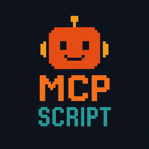

<p align="center">
  
</p>
<p align="center">An Agent-Oriented Programming Language</p>
<p align="center">
  <a href="https://discord.gg/Wsy2NpnZDu" target="_blank"></a>
  <a href="https://www.npmjs.com/package/@mcpscript/cli" target="_blank"></a>
  <a href="https://github.com/sst/opencode/actions/workflows/publish.yml" target="_blank"></a>
</p>

<p align="center">
  <a href="https://atlassian.com/rovo-dev" target="_blank">Built with Atlassian Rovo Dev - #1 SWE-Bench Agent</a>
  <br/>
  <br/>
  <a href="https://github.com/run-llama/LlamaIndexTS" target="_blank">Based on LlamaIndex.TS</a> •
  <a href="https://github.com/tree-sitter/tree-sitter" target="_blank">Parsed with Tree-Sitter</a> •
  <a href="https://modelcontextprotocol.io" target="_blank">Designed around Model Context Protocol</a>
</p>

---

## The Problem Space

Most agentic applications require orchestrating both deterministic steps and intelligent agents.
Developers currently piece together these applications using general-purpose programming languages with external orchestration frameworks, often leading to:

- Verbose boilerplate for agent configuration, workflow orchestration and tool integration
- Difficulty expressing agentic workflows that seamlessly blend both deterministic and agentic logic
- Easy to introduce antipatterns that lead to brittle, unmaintainable codebases

## Introducing MCP Script

MCP Script is the first agent-oriented programming language specifically designed to express agentic applications.

Here's an example - an Claude Code-like agent:

```typescript
// Configure a local AI model using Ollama
model gpt {
  provider: "openai",
  apiKey: "ollama",
  baseURL: "http://localhost:11434/v1",
  model: "gpt-oss:20b",
  temperature: 0.1
}

// Set up the filesystem MCP server
mcp filesystem {
  command: "npx",
  args: ["-y", "@modelcontextprotocol/server-filesystem@latest"],
  stderr: "ignore"
}

// Read the memory file (AGENTS.md) from the current directory
memoryContent = filesystem.read_file({ path: "AGENTS.md" })
print("Memory file loaded successfully (" + memoryContent.length + " characters)")

// Define a software developer agent with access to filesystem tools
agent SoftwareDeveloper {
  model: gpt,
  systemPrompt: "You are an expert software developer assistant. You have access to filesystem tools and can help with code analysis, debugging, and development tasks. Be concise and helpful.",
  tools: [filesystem]
}

print("Type 'exit' or 'quit' to end the conversation.\n")

// Compose the first message
userMessage = input("You: ")
initialMessage = "Here is the memory file (AGENTS.md) for context:\n\n" + memoryContent + "\n\n---\n\nUser request: " + userMessage

// Send first message to the SoftwareDeveloper agent
conversation = initialMessage | SoftwareDeveloper

// REPL
while (true) {
  // Get next user input
  userMessage = input("You: ")

  // Check if user wants to exit
  if (userMessage == "exit" || userMessage == "quit") {
    print("Goodbye!")
    break
  }

  // Continue the conversation with the new user message
  conversation = conversation | userMessage | SoftwareDeveloper
}
```

## Getting Started

> **⚠️ Early Development Warning:** MCP Script is in early development and the language syntax, features, and APIs are subject to change. Use at your own risk in production environments.

### Installation

You can run MCP Script files directly using npx:

```bash
npx @mcpscript/cli run path/to/your-script.mcps
```

Or install the CLI globally for easier access:

```bash
npm install -g @mcpscript/cli
mcps run path/to/your-script.mcps
```

### CLI Commands

#### `mcps run <file>`

Executes an MCP Script file.

```bash
mcps run my-script.mcps
```

**Options:**

- `--timeout <ms>` - Set execution timeout in milliseconds (default: no timeout)

**Environment Variables:**

The CLI automatically loads environment variables from a `.env` file in the current working directory before running your script. This makes it easy to manage configuration and secrets:

```bash
# .env file
OPENAI_API_KEY=sk-...
ANTHROPIC_API_KEY=sk-ant-...
DATABASE_URL=postgresql://...
```

```typescript
// my-script.mcps
model gpt4 {
  provider: "openai",
  apiKey: env.OPENAI_API_KEY,
  model: "gpt-4"
}

print("Using database:", env.DATABASE_URL)
```

#### `mcps compile <file>`

Transpiles an MCP Script file to JavaScript without executing it.

```bash
mcps compile my-script.mcps
```

This outputs the generated JavaScript code to stdout, which can be useful for:

- Debugging transpilation issues
- Understanding how MCP Script code translates to JavaScript
- Integrating with custom build pipelines

## Language Specification

For detailed information about the MCP Script language syntax and features, see the [Language Specification](spec/mcp-script-spec.md).

## Contributing

We welcome contributions! Please see our [Contributing Guide](CONTRIBUTING.md) for details on how to get started.

## Code of Conduct

Please read our [Code of Conduct](CODE_OF_CONDUCT.md) to understand the expectations for all participants in our community.

## Changelog

See [CHANGELOG.md](CHANGELOG.md) for a history of changes to this project.
